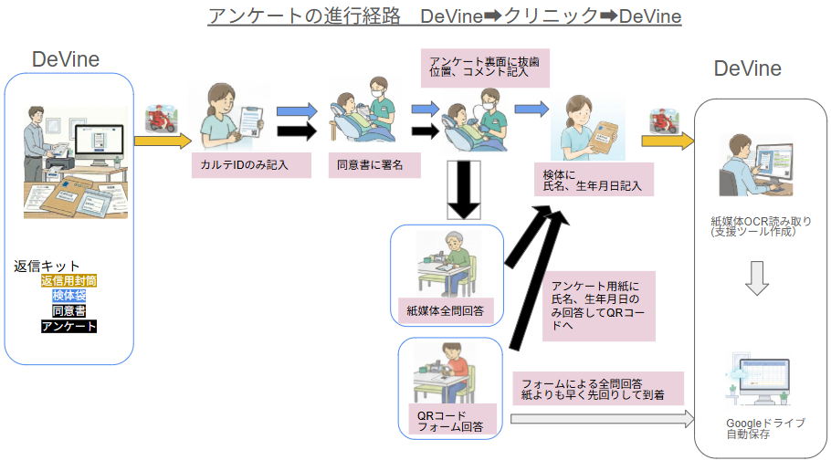
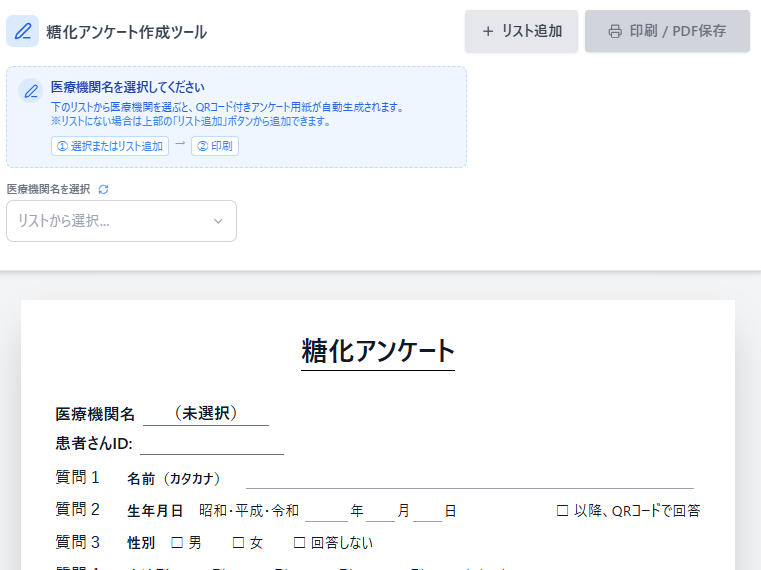
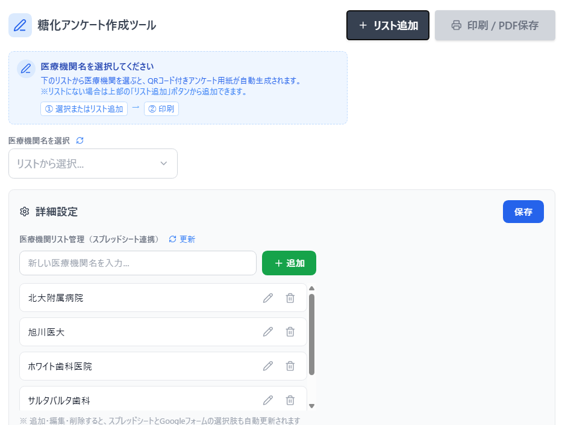
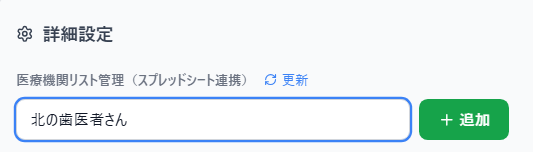
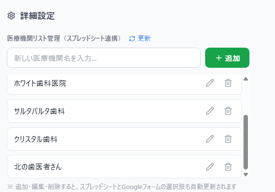
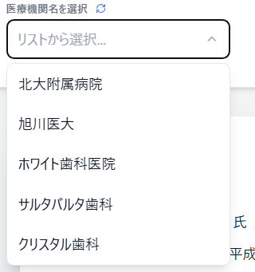
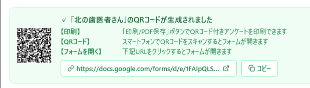
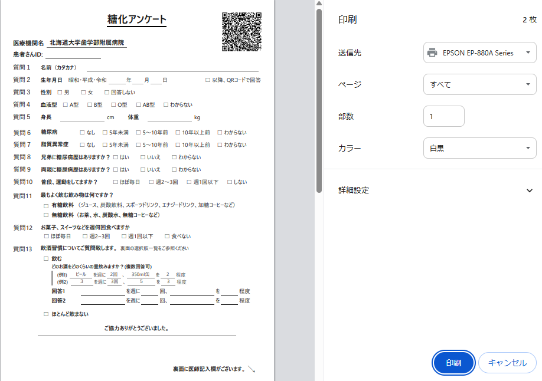
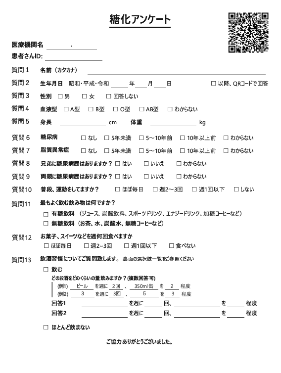
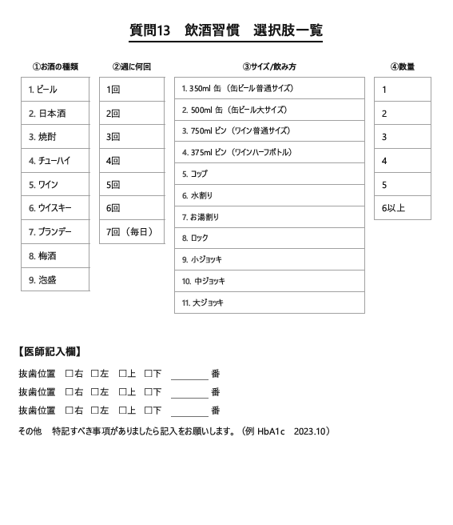

# 糖化アンケート作成ツール

糖化に関するアンケートを作成・管理するためのシステムです。

---

## 📑 目次

1. [はじめに](#1-はじめに)
   - [アンケート運用の全体フロー](#アンケート運用の全体フロー)
   - [URL一覧](#url一覧)
   - [このシステムでできること](#このシステムでできること)
2. [クイックスタート](#2-クイックスタート)
3. [操作マニュアル](#3-操作マニュアル)
   - [メイン画面](#メイン画面)
   - [医療機関リストの管理](#医療機関リストの管理)
   - [印刷・PDF保存](#印刷pdf保存)
   - [URLのコピー・共有](#urlのコピー共有)
4. [システム構成](#4-システム構成)
   - [全体構成図](#全体構成図)
   - [ファイルの保存場所](#ファイルの保存場所)
   - [Vercel と GitHub の関係](#vercel-と-github-の関係)
5. [開発者向け情報](#5-開発者向け情報)
   - [技術スタック](#技術スタック)
   - [ファイル構成](#ファイル構成)
   - [質問を追加する時のチェックリスト](#質問を追加する時のチェックリスト)
6. [管理者向け情報](#6-管理者向け情報)
   - [Vercelへのログイン方法](#vercelへのログイン方法)
7. [更新履歴](#7-更新履歴)

---

## 1. はじめに

### アンケート運用の全体フロー



---

### URL一覧

| 項目 | URL | 備考 |
|------|-----|------|
| アンケート作成ツール | https://touka-survey.vercel.app | 誰でもアクセス可能 |
| GitHub | https://github.com/hashimoto-hiroyuki/touka-survey | ソースコード |
| Vercel管理画面 | https://vercel.com | GitHubアカウントでログイン |

### このシステムでできること

| 機能 | 説明 |
|------|------|
| 📄 紙アンケート印刷 | 医療機関名入りのアンケートをA4で印刷 |
| 📱 QRコード生成 | Googleフォームへのリンク付きQRコードを自動生成 |
| 🏥 医療機関管理 | 医療機関の追加・編集・削除 |
| 🔄 自動同期 | スプレッドシート・Googleフォームと自動連携 |

---

## 2. クイックスタート

**4ステップでアンケートを印刷できます**

```
┌─────────────────────────────────────────────────────────────────┐
│                                                                 │
│   ① サイトにアクセス                                            │
│      https://touka-survey.vercel.app                           │
│                         ↓                                       │
│   ② 医療機関を選択                                              │
│      「リストから選択」で医療機関を選ぶ                          │
│                         ↓                                       │
│   ③ QRコード確認                                                │
│      QRコードが自動生成されたことを確認                          │
│                         ↓                                       │
│   ④ 印刷                                                        │
│      「印刷 / PDF保存」ボタンをクリック                          │
│                                                                 │
└─────────────────────────────────────────────────────────────────┘
```

---

## 3. 操作マニュアル

### メイン画面



---

### 医療機関リストの管理

#### 設定画面を開く

1. 画面右上の **「+ リスト追加」** ボタンをクリック
2. 「詳細設定」パネルが開く
3. 「医療機関リスト管理」セクションで操作



---

#### 医療機関を追加する

1. 「新しい医療機関名を入力...」欄に名前を入力
2. **「+ 追加」** ボタンをクリック



3. リストに追加され、スプレッドシートとGoogleフォームも自動更新



---

#### 医療機関名を編集する

1. 編集したい医療機関にマウスを合わせる
2. 右側に表示される **鉛筆アイコン（✏️）** をクリック
3. 名前を編集
4. **保存アイコン（💾）** をクリック、またはEnterキーを押す

---

#### 医療機関を削除する

1. 削除したい医療機関にマウスを合わせる
2. 右側に表示される **ゴミ箱アイコン（🗑️）** をクリック
3. 確認ダイアログで「OK」をクリック

> ⚠️ **注意**: 削除するとスプレッドシートとGoogleフォームの選択肢からも削除されます

---

#### 設定を保存する

変更後は **「保存」** ボタンをクリックして設定を保存してください。


---

#### リストを更新する

他の人が追加・編集した内容を反映するには：

1. 「医療機関リスト管理」の横にある **「🔄 更新」** をクリック
2. 最新のリストが読み込まれる

---

### 印刷・PDF保存

#### 1. 医療機関を選択

ドロップダウンから医療機関を選択します。



---

#### 2. QRコードが生成されたことを確認

医療機関を選択すると、QRコードが自動生成されます。



この画面から3つの方法でアンケートを実施できます：

| 方法 | 説明 |
|------|------|
| 【印刷】 | QRコード付きの紙のアンケートを印刷して配布 |
| 【QRコード】 | スマートフォンでQRコードを読み取り、オンラインで回答 |
| 【フォームを開く】 | URLをコピーしてPCからオンラインで回答 |

---

#### 3. 印刷する

**「印刷 / PDF保存」** ボタンをクリックします。


---

#### 4. 印刷ダイアログ

印刷プレビューが表示されます。



- **印刷**: プリンターを選択して印刷
- **PDF保存**: 「PDFに保存」を選択

> **ページについて**: デフォルトでは2ページ印刷されます。
> - **1ページ目**: アンケート用紙
> - **2ページ目**: 飲酒習慣の選択肢リスト
>
> 2ページ目は飲酒習慣の質問に回答する際の参考資料です。必要に応じて1ページ目のみ印刷することもできます。

---

#### 印刷されるアンケート

**1ページ目：アンケート用紙**



**2ページ目：飲酒習慣 選択肢リスト**



---

### URLのコピー・共有

生成されたフォームURLを共有したい場合：

1. 医療機関を選択
2. 「生成されたフォームURL」欄の横にある **「コピー」** ボタンをクリック
3. URLがクリップボードにコピーされる
4. メールやチャットに貼り付けて共有

---

## 4. システム構成

### 全体構成図

```
┌─────────────────────────────────────────────────────────────────────┐
│                        データ管理層                                   │
├─────────────────────────────────────────────────────────────────────┤
│                                                                     │
│  [スプレッドシート①]                [スプレッドシート②]               │
│   医療機関リスト                     フォーム回答データ                │
│   ├─ 医療機関名の追加/編集/削除       ├─ 回答が自動保存                │
│   └─ Apps Scriptと連携               └─ 質問追加時、列が自動追加      │
│                                                                     │
└─────────────────────────────────────────────────────────────────────┘
                    │                           ↑
                    ↓                           │
┌─────────────────────────────────────────────────────────────────────┐
│                        サーバー層                                    │
├─────────────────────────────────────────────────────────────────────┤
│                                                                     │
│  [Google Apps Script]  ← Web App（デプロイURLで公開）                │
│   ├─ 医療機関リスト取得 (getHospitalList)                            │
│   ├─ 医療機関追加/編集/削除                                          │
│   ├─ Googleフォームの選択肢を自動同期                                 │
│   └─ rebuildFullForm() ← 質問追加時はここも更新                      │
│                                                                     │
│  【設定】                                                            │
│   ├─ アクセスできるユーザー: 全員                                     │
│   └─ デプロイURL → ReactアプリのAPI_URLと一致させる                   │
│                                                                     │
└─────────────────────────────────────────────────────────────────────┘
                    │
                    ↓
┌─────────────────────────────────────────────────────────────────────┐
│                      フロントエンド層                                 │
├─────────────────────────────────────────────────────────────────────┤
│                                                                     │
│  [Googleフォーム]                   [Reactアプリ（Vercel）]          │
│   ├─ オンライン回答用                ├─ 紙アンケート印刷用            │
│   ├─ 質問の追加/編集                 ├─ 医療機関ドロップダウン選択     │
│   ├─ 回答→スプレッドシート②に保存    ├─ prefill URL自動生成          │
│   └─ 選択肢はApps Scriptと同期       ├─ QRコード生成                 │
│                                      └─ PDF印刷                     │
│                                                                     │
└─────────────────────────────────────────────────────────────────────┘
                    │
                    ↓
┌─────────────────────────────────────────────────────────────────────┐
│                        バックアップ                                   │
├─────────────────────────────────────────────────────────────────────┤
│                                                                     │
│  [GitHub]                                                           │
│   ├─ src/SurveyEditor.jsx  ← Reactアプリのソース                     │
│   └─ Code.gs               ← Apps Scriptのバックアップ               │
│                                                                     │
└─────────────────────────────────────────────────────────────────────┘
```

---

### ファイルの保存場所

このシステムのファイルは **2つの場所** に分かれて保存されています。

```
┌─────────────────────────────┐     ┌─────────────────────────────┐
│   GitHub / Vercel           │     │   Googleドライブ             │
│   (ソースコード)             │     │   (データ・フォーム)          │
├─────────────────────────────┤     ├─────────────────────────────┤
│ ・SurveyEditor.jsx          │     │ ・Googleフォーム             │
│ ・Code.gs (バックアップ)     │     │ ・Google Apps Script        │
│ ・README.md                 │     │ ・スプレッドシート①          │
│ ・package.json              │     │   (医療機関リスト)           │
│ ・index.html                │     │ ・スプレッドシート②          │
│ ・vite.config.js            │     │   (回答データ)              │
└─────────────────────────────┘     └─────────────────────────────┘
```

#### GitHub / Vercel にあるもの

| ファイル | 説明 |
|----------|------|
| src/SurveyEditor.jsx | 紙アンケート印刷アプリ |
| Code.gs | Apps Scriptのバックアップ |
| README.md | このドキュメント |
| index.html | HTMLテンプレート |
| package.json | 依存関係 |
| vite.config.js | ビルド設定 |

#### Googleドライブにあるもの

| ファイル | 説明 |
|----------|------|
| Googleフォーム | オンライン回答用フォーム |
| Google Apps Script | サーバー処理（API）**※実際に動作する本体** |
| スプレッドシート① | 医療機関リスト |
| スプレッドシート② | フォーム回答データ |

> ⚠️ **重要**: Google Apps Script（Code.gs）は2箇所にあります
> - **Googleドライブ**: 実際に動作している本体 → **変更はここで行う**
> - **GitHub**: バックアップ用のコピー → 変更後にコピーを保存

---

### Vercel と GitHub の関係

```
┌─────────────────────────────────────────────────────────────────────┐
│                         開発者（あなた）                              │
└─────────────────────────────────────────────────────────────────────┘
                                  │
                                  │ ① コードを編集・保存（Commit）
                                  ↓
┌─────────────────────────────────────────────────────────────────────┐
│                           GitHub                                    │
│                     （ソースコード保管庫）                             │
├─────────────────────────────────────────────────────────────────────┤
│   touka-survey リポジトリ                                            │
│   ├── src/SurveyEditor.jsx                                          │
│   ├── Code.gs                                                       │
│   └── README.md                                                     │
└─────────────────────────────────────────────────────────────────────┘
                                  │
                                  │ ② 変更を自動検知
                                  ↓
┌─────────────────────────────────────────────────────────────────────┐
│                           Vercel                                    │
│                   （ホスティングサービス）                             │
├─────────────────────────────────────────────────────────────────────┤
│   ③ 自動ビルド → ④ 自動デプロイ                                      │
│         ↓                                                           │
│   https://touka-survey.vercel.app で公開                            │
└─────────────────────────────────────────────────────────────────────┘
                                  │
                                  │ ⑤ アクセス
                                  ↓
┌─────────────────────────────────────────────────────────────────────┐
│                        ユーザー（患者・医師）                          │
└─────────────────────────────────────────────────────────────────────┘
```

#### 🚀 ポイント：自動デプロイの仕組み

```
╔═══════════════════════════════════════════════════════════════════╗
║                                                                   ║
║   ★ GitHubにCommitするだけで、サイトが自動更新される！ ★          ║
║                                                                   ║
║   ・サーバーの設定 → 不要                                         ║
║   ・ファイルのアップロード → 不要                                  ║
║   ・反映までの時間 → 約1〜2分                                      ║
║                                                                   ║
║   この仕組みを「CI/CD（継続的デプロイ）」と呼びます                 ║
║                                                                   ║
╚═══════════════════════════════════════════════════════════════════╝
```

| 順番 | 何が起きる | 所要時間 |
|------|-----------|----------|
| ① | GitHubでコードをCommit | 手動 |
| ② | VercelがGitHubの変更を検知 | 数秒 |
| ③ | Vercelが自動でビルド | 約1分 |
| ④ | Vercelが自動でデプロイ | 約30秒 |
| ⑤ | 新しいサイトが公開される | **合計1〜2分** |

---

## 5. 開発者向け情報

### 技術スタック

| 項目 | 技術 |
|------|------|
| フロントエンド | React + Vite |
| ホスティング | Vercel |
| バックエンド | Google Apps Script |
| データベース | Google スプレッドシート |
| フォーム | Google フォーム |

---

### ファイル構成

```
touka-survey/
├── src/
│   └── SurveyEditor.jsx   # メインのReactコンポーネント
├── public/
├── Code.gs                 # Google Apps Script（バックアップ）
├── index.html
├── package.json
├── vite.config.js
└── README.md
```

---

### 質問を追加する時のチェックリスト

| # | 変更箇所 | 作業内容 | 必須 |
|---|----------|----------|------|
| 1 | **Googleフォーム** | 質問を追加 | ✅ |
| 2 | **SurveyEditor.jsx** | 紙アンケートのレイアウトに質問を追加 | ✅ |
| 3 | **Code.gs** | rebuildFullForm()に質問を追加、番号修正 | ⚠️ 推奨 |
| 4 | **Apps Script デプロイ** | 新バージョンをデプロイ | ⚠️ Code.gs変更時 |
| 5 | **SurveyEditor.jsx API_URL** | デプロイURLが変わった場合のみ更新 | ⚠️ URL変更時 |
| 6 | **GitHub** | 変更したファイルをコミット | ⚠️ 推奨 |
| 7 | **スプレッドシート（回答）** | 変更不要（列は自動追加） | ー |
| 8 | **スプレッドシート（医療機関）** | 変更不要 | ー |

---

## 6. 管理者向け情報

### Vercelへのログイン方法

```
╔═══════════════════════════════════════════════════════════════╗
║                                                               ║
║   VercelはGitHubアカウントと連携しているので、                 ║
║   GitHubにログインできれば、Vercelにもアクセスできます         ║
║                                                               ║
║   必要な情報:                                                  ║
║   ・GitHubのユーザー名またはメールアドレス                     ║
║   ・GitHubのパスワード                                        ║
║                                                               ║
╚═══════════════════════════════════════════════════════════════╝
```

#### ステップ1: Vercelにアクセス

1. ブラウザで https://vercel.com を開く
2. 右上の **「Log In」** ボタンをクリック

#### ステップ2: GitHubでログインを選択

```
┌─────────────────────────────────────┐
│         Log in to Vercel            │
├─────────────────────────────────────┤
│                                     │
│   ┌─────────────────────────────┐   │
│   │  Continue with GitHub  ←    │   │ ← これをクリック
│   └─────────────────────────────┘   │
│                                     │
│   ┌─────────────────────────────┐   │
│   │  Continue with GitLab       │   │
│   └─────────────────────────────┘   │
│                                     │
│   ┌─────────────────────────────┐   │
│   │  Continue with Bitbucket    │   │
│   └─────────────────────────────┘   │
│                                     │
└─────────────────────────────────────┘
```

1. ログイン方法の選択画面が表示される
2. **「Continue with GitHub」** をクリック

#### ステップ3: GitHubの認証

```
┌─────────────────────────────────────┐
│         Sign in to GitHub           │
├─────────────────────────────────────┤
│                                     │
│   Username or email address         │
│   ┌─────────────────────────────┐   │
│   │ ここにユーザー名を入力       │   │
│   └─────────────────────────────┘   │
│                                     │
│   Password                          │
│   ┌─────────────────────────────┐   │
│   │ ここにパスワードを入力       │   │
│   └─────────────────────────────┘   │
│                                     │
│   ┌─────────────────────────────┐   │
│   │        Sign in              │   │
│   └─────────────────────────────┘   │
│                                     │
└─────────────────────────────────────┘
```

1. GitHubのログイン画面が表示される
2. **GitHubのユーザー名（またはメール）** を入力
3. **GitHubのパスワード** を入力
4. **「Sign in」** をクリック

#### ステップ4: Vercelダッシュボードが開く

```
┌─────────────────────────────────────────────────────────┐
│  Vercel Dashboard                                       │
├─────────────────────────────────────────────────────────┤
│                                                         │
│   Your Projects                                         │
│                                                         │
│   ┌─────────────────────────────────────────────────┐   │
│   │  touka-survey                    ● Ready        │   │ ← クリック
│   │  touka-survey.vercel.app                        │   │
│   └─────────────────────────────────────────────────┘   │
│                                                         │
└─────────────────────────────────────────────────────────┘
```

1. ログイン成功後、Vercelのダッシュボードが表示される
2. **「touka-survey」** プロジェクトをクリックして管理画面へ

---

## 7. 更新履歴

| 日付 | 内容 |
|------|------|
| 2026/01/07 | 血液型の質問を追加 |
| 2026/01/07 | A4 1枚に収まるようレイアウト調整 |
| 2026/01/07 | アクセス権限を「全員」に変更 |
| 2026/01/07 | README.mdを整理・目次追加 |
